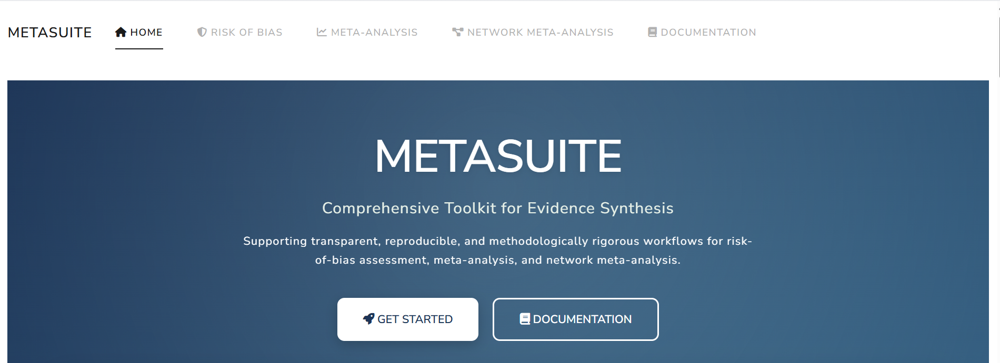
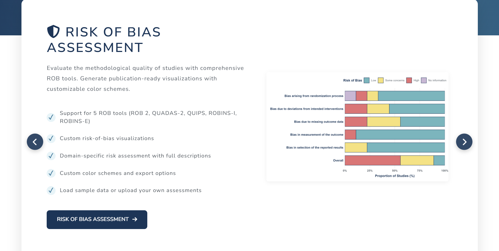
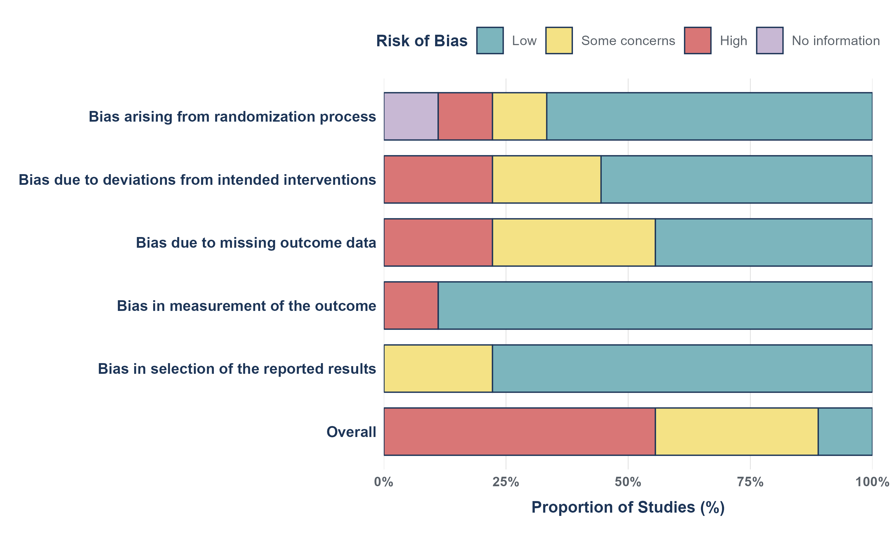
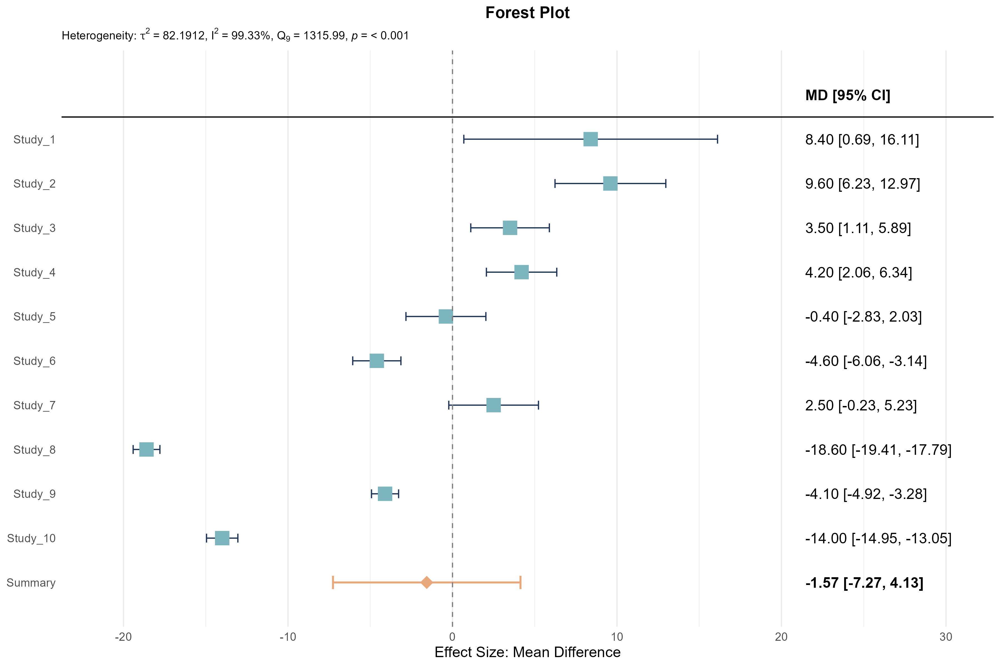

# MetaSuite 📊

> A comprehensive, standards-aligned toolkit for evidence synthesis, meta-analysis, network meta-analysis, and risk-of-bias assessment.

**MetaSuite** is an open-source **R Shiny application** designed to support **transparent, reproducible, and methodologically rigorous evidence synthesis**.  
It provides structured workflows, validated analytical methods, and **publication-ready visualizations**, aligned with **PRISMA**, **Cochrane**, and **network meta-analysis reporting standards**.

MetaSuite is intended for:
- Systematic reviewers
- Clinical and epidemiological researchers
- Biostatisticians
- Evidence synthesis and HTA teams

[Live MetaSuite app](https://hirak-sen-roy.shinyapps.io/metasuite/)

---

## 🌐 Application Overview

MetaSuite is implemented as a **modular Shiny application** with three core analytical modules:

- 🛡️ **Risk of Bias (ROB) Assessment**
- 📊 **Pairwise Meta-Analysis**
- 🔗 **Network Meta-Analysis (NMA)**

Each module provides:
- Built-in **sample datasets** for validation and learning
- Strict **data format validation**
- Step-by-step **analysis workflows**
- **Customizable, high-resolution (300 DPI)** visual outputs

The user interface is built using **Bootstrap 5 / bslib**, with a consistent, publication-focused visual design.

---

## 🖼️ Screenshots & Visual Examples


### Application Screenshots





### Plot Examples


---

## 🛡️ Risk of Bias Module

The **Risk of Bias (ROB)** module supports structured assessment of internal validity across multiple study designs using established methodological frameworks.

### Supported ROB Tools

- **ROB 2** – Randomized controlled trials
- **ROBINS-I** – Non-randomized studies of interventions
- **ROBINS-E** – Non-randomized studies of exposures
- **QUADAS-2** – Diagnostic accuracy studies
- **QUIPS** – Prognostic factor studies

Each tool includes:
- Tool-specific domains
- Validated risk categories
- Automatic domain mapping and validation

### Key Features

- Upload **CSV / Excel (`.xlsx`)** datasets or use sample data
- Interactive data table with sorting, filtering, and in-place editing
- Tool-aware validation of domains and risk categories
- Immediate synchronization between data and plots

### Visualizations

- **Weighted bar plots** – domain-level risk distribution
- **Traffic-light plots** – study × domain risk matrix
- **Heatmaps** – numeric encoding with row/column averages

### Plot Examples




All plots support **color customization**, **font scaling**, and **300 DPI export**.

---

## 📊 Meta-Analysis Module (Pairwise)

The **Meta-Analysis** module performs classical pairwise meta-analysis with comprehensive diagnostics and reporting support.

### Supported Outcome Types

- **Continuous outcomes** (e.g., blood pressure, scores)
- **Dichotomous outcomes** (event / no event)
- **Correlation outcomes**

Strict, validated data structures are enforced, with sample datasets available under `data/meta/`.

### Analytical Capabilities

- Multiple effect size measures across outcome types
- Fixed- and random-effects models
- Heterogeneity assessment (I², τ², Q-statistic)
- Publication bias diagnostics (funnel plots, tests, trim-and-fill)
- Influence and sensitivity analyses
- Subgroup (categorical moderator) analysis

### Visualizations

- **Forest plots** - Summarizes study effects and pooled result
- **Funnel plots** - Detects publication bias
- **Sunset (power-enhanced) plots** - Assesses statistical power
- **Influence and leave-one-out diagnostics** - Identifies influential studies and outliers. Provided tests result robustness 

### Plot Examples



\\


All figures are **customizable** and **exportable at publication quality (300 DPI)**.

---

## 🔗 Network Meta-Analysis Module

The **Network Meta-Analysis (NMA)** module enables simultaneous comparison of **three or more interventions**, combining direct and indirect evidence within a connected network.

### Key Capabilities

- Arm-level continuous and dichotomous data
- Multiple effect measures (MD, SMD, OR, RR, RD)
- Random- and common-effects models
- Heterogeneity and inconsistency diagnostics
- Evidence flow and design-based checks
- Treatment ranking with uncertainty visualization

### Visualizations

- **Network plots** -  nodes and edges scaled by evidence
- **Network forest plots** - Compare treatment effects against a reference
- **Direct vs indirect evidence plots** - Quantify contribution of evidence sources
- **Ranking plots** -  SUCRA, rank probabilities, radial heat plots
- **Inconsistency diagnostics** -  net heat, design-Q plots

### Plot Examples


All NMA outputs emphasize **interpretability, transparency, and reporting clarity**.


## 🚀 Getting Started (Local)

1. Clone the repository:


2. Restore dependencies:

   ```r
   renv::restore()
   ```

3. Run the application:

   ```r
   shiny::runApp()
   ```

4. Explore each module using the sample datasets in `data/`.

---

## 📚 Documentation

Detailed methodological documentation is available for each module and covers:

- Data format specifications
- Effect measure selection
- Statistical interpretation
- Best-practice recommendations
- Troubleshooting guidance

Refer to the in-app **Help** sections or accompanying documentation files for full details.

---

## 🆘 Support

For questions, bug reports, or feature requests:

- Open a GitHub issue
- Contact the development team

---

**Built with ❤️ for the evidence synthesis community.**  
⭐ If you find MetaSuite useful, consider starring the repository.
